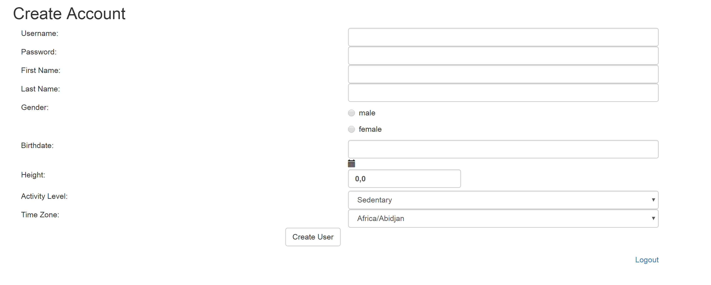
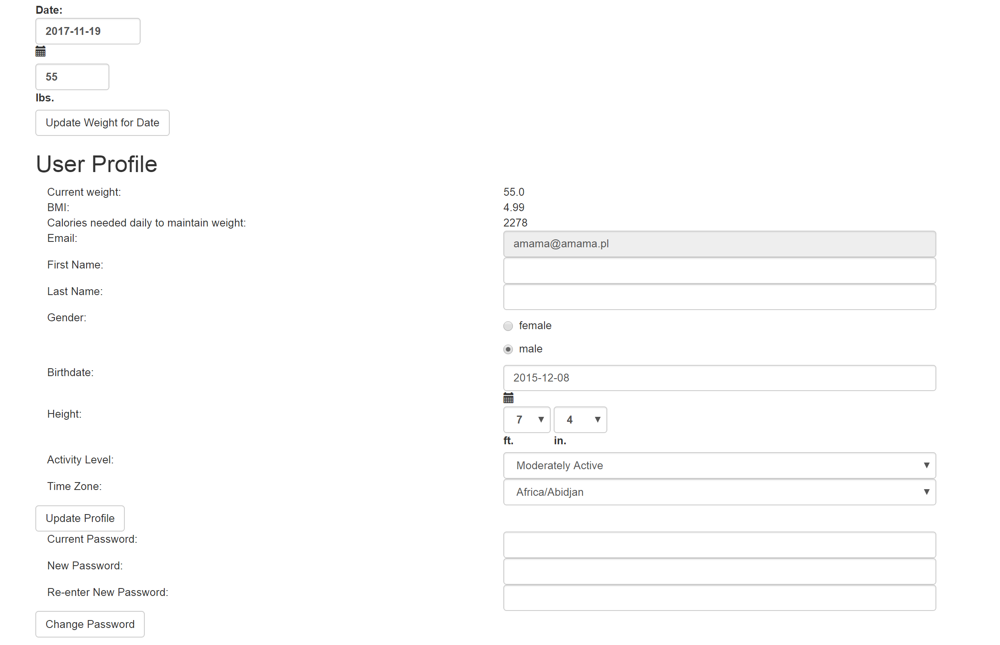
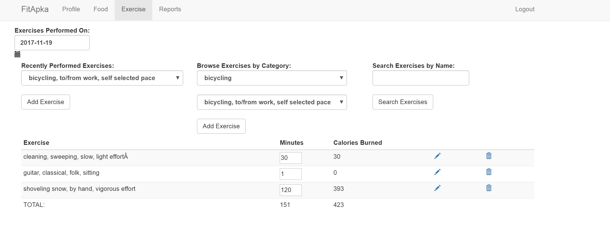
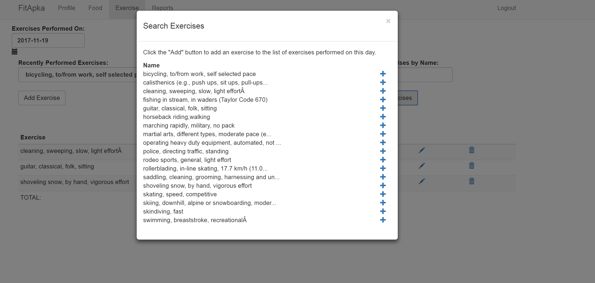
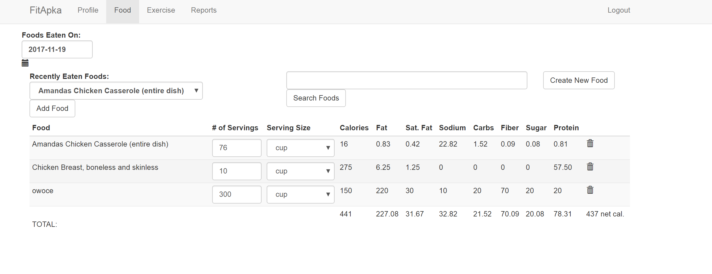
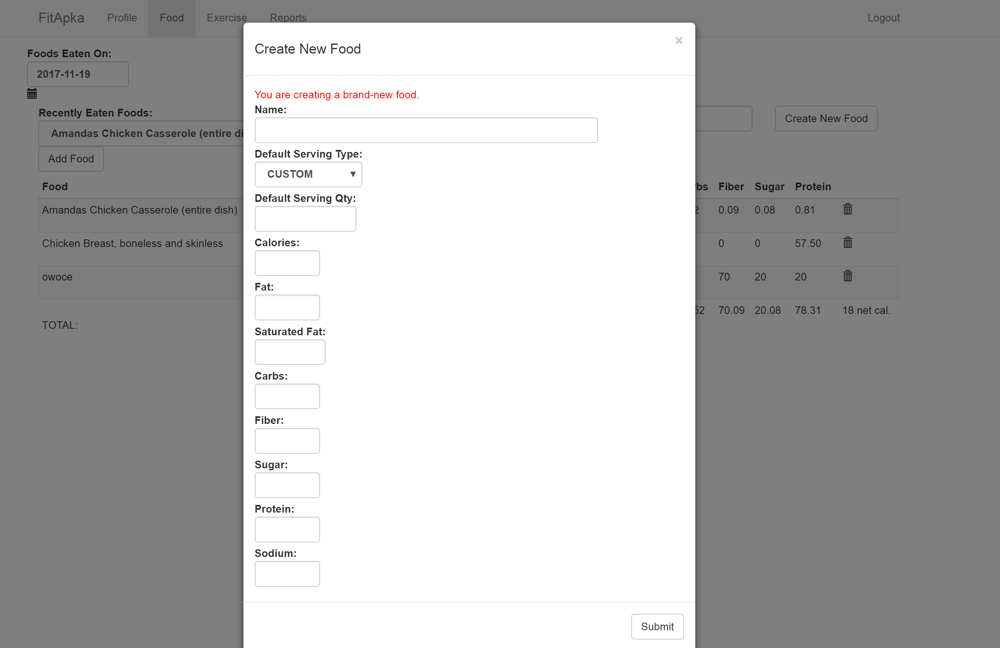
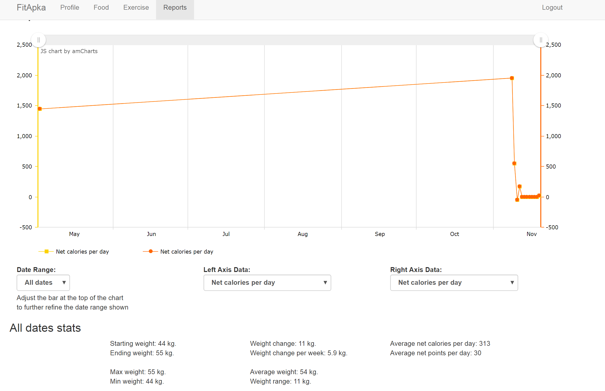

# FitApkaRepozytorium
FitApkaRepozytorium

<strong>Technologies Used</strong>

Java 8  
Spring Boot  
Spring Data JPA  
Spring Security  
MySQL (with H2 for unit testing)  
Thymeleaf templates  
Bootstrap  
jQuery  
Maven  
JUnit  

Login and logout is built around Spring Security         
  
Register page for new users          

Users can track their weight on a daily basis, and their profile will show their current body-mass index (BMI) and the estimated number of daily calories needed to maintain their current weight:        
    

Tracking and editing of exercises eaten each day  
Users have quick access to recently-performed exercises (i.e. within the previous two weeks), can search for exercises by full or partial name, and can browse exercises by category.        
  

  

Tracking and editing of foods eaten each day:      
  

The database includes a built-in set of "global" foods, which are visible to all users but cannot be modified. When a user modifies a "global" food, or simply creates a new food from scratch, then a food is created in that user's "private" set of foods. This is all transparent to the user.      
        

      
FitApka stores for each day a summary of each user's stats (e.g. weight, calories burned, etc), for quick retrieval as JSON so that charts can be rendered and report data summarized on the client-side. Whenever any data pertaining to a user changes, FitApka schedules a background thread to update that user's report data for the affected data range. This thread is scheduled to run after a five-minute delay, to avoid unnecessary duplication when the user makes multiple changes within a short period of time.  
